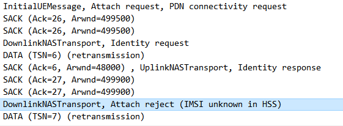
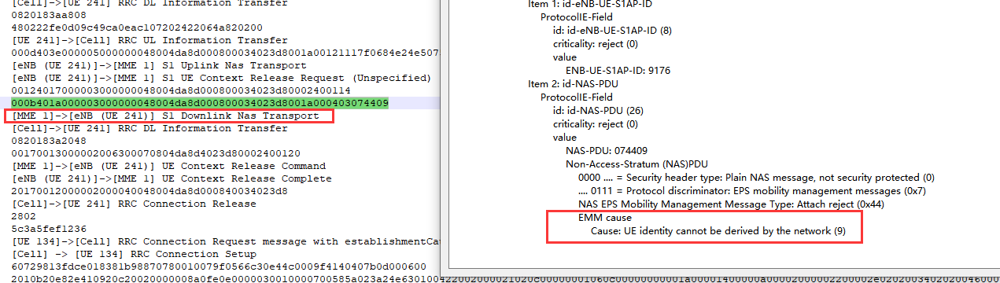
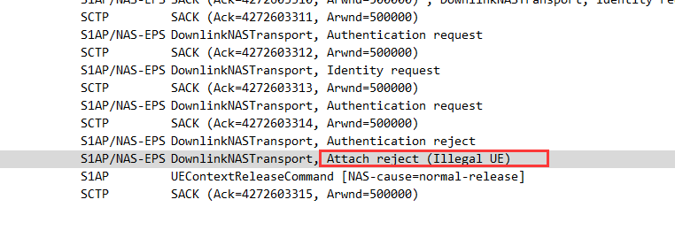
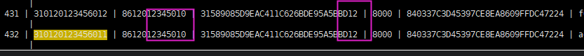

[toc]

## IMSI unknown in HSS

解决方案：

1.未在HSS添加卡号

2.添加了重复的卡号

3.卡号已存在，可能是HSS的问题，可能需要重启

## UE identity cannot be derived by the network

解决方案：

1.在HSS数据库中查找SIM卡的卡号是否存在

2.HSS自身问题

## Attach reject-Illegal UE

HSS中msisdn和secretkey的配置问题

解决方案：

msisdn需配置不同，secretkey与上一个配置保持一致

