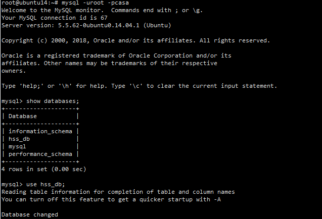
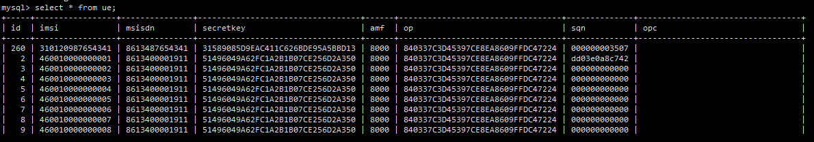

[toc]

## 1.进入数据库

> mysql -uroot -pcasa
>
> show databases;
>
> use hss_db;

## 2.查看UE表

> select * from ue;

## 3.删除记录

> delete from ue where id="id";

## 4.插入记录

> insert into ue (imsi,msisdn,secretkey,amf,op,sqn,opc) values ('310120123456012','8612012345010','31589085D9EAC411C626BDE95A5BBD13','8000','840337C3D45397CE8EA8609FFDC47224','000000000000','');

- 注：msisdn要不同，secretkey与上一个对齐，sqn处全填0，接入成功后会变

  

## 5.更新记录

> update ue set msisdn="8612345678934" WHERE id="277";