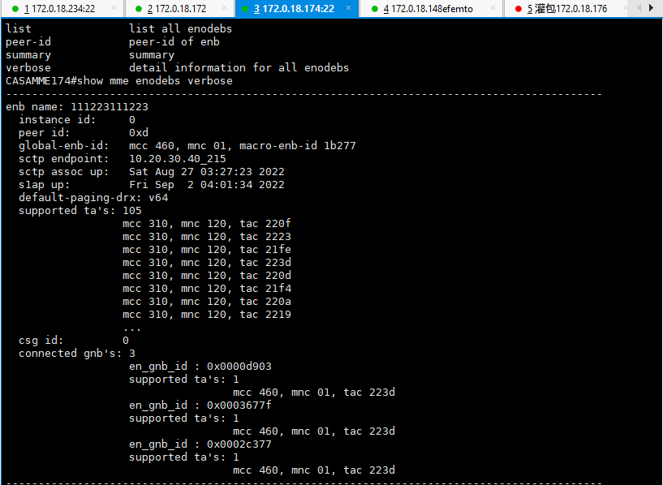
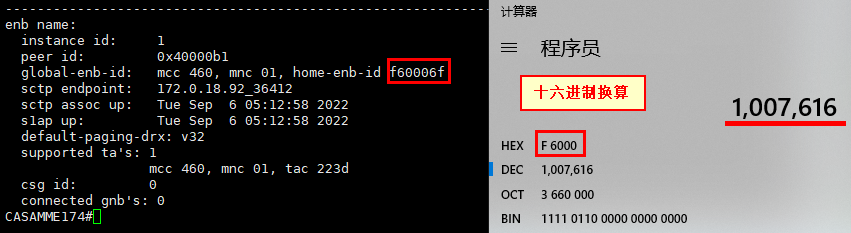
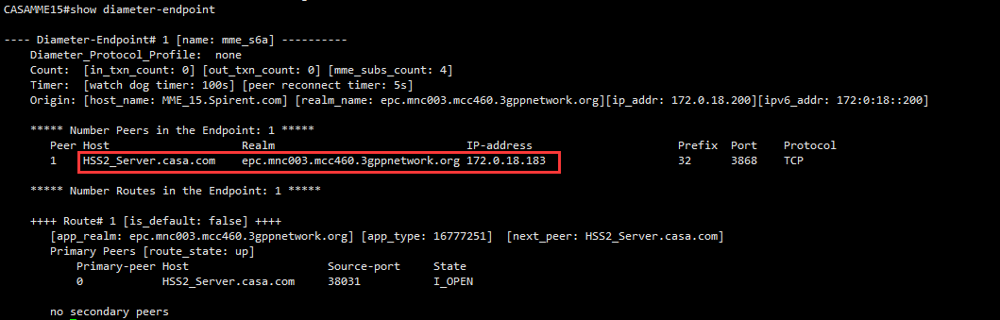
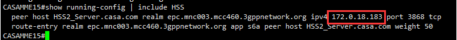
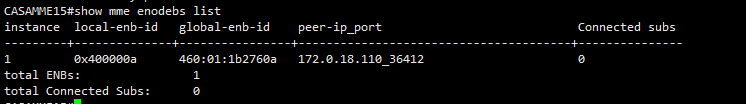

[toc]

## 1.查看已连接的基站的具体信息

> show mme enodebs verbose

下图中的f60006f是1007616-111换算来的
基站的cellidentity为1007616*256+111=257949807

## 2.查找相连的HSS

> show diameter-endpoint

> show running-config | include HSS

- 注：include后严格区分大小写

## 3.查看已相连的基站（简洁）

> show mme enodebs list

