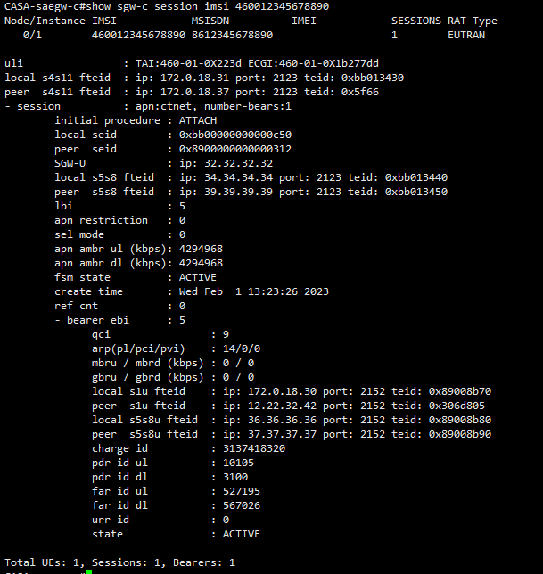

[toc]

## 1.查看已接入的UE数量以及已经接入的UE数量

> show pgw-c pool all

## 2.根据IMSI查找UE的详细信息（APN-AMBR-QCI）

> show sgw-c session imsi 460012345678890

## 3.从saegw处发起UE Detach的效果

> clear sgw-c session imsi 460012345678890

