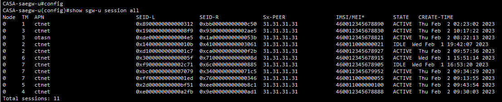
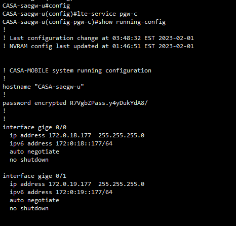
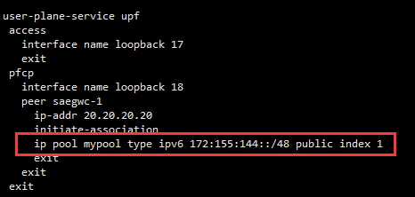

[toc]

## 1.显示所有UE在用户面的相关信息（APN/IMSI/STATE等）

>show sgw-u session all

## 2.查看pgw-c的配置

> config
>
> lte-service pgw-c
>
> show running-config

## 3.在pgw-c中修改IP池（没用过）

> config
>
> lte-service pgw-c
>
> no ip pool mypool index 1
>
> ip pool mypool type ipv6 172:155:144::/48 public index 1
>
> copy running-config startup-config

- 注：先禁掉再修改，最后保存

